# Galgame → TTS（GPT-SoVITS）全流程实用教程

---

*示例语音已上传到项目`Example_voice`目录下，文本如下*

*audio_6(雾枝--美少女万华镜):今日はとても静かな朝です。窓の外では鳥がさえずり、やわらかな風がカーテンを揺らしています。コーヒーの香りに包まれながら、ゆっくりと一日が始まります。こんな穏やかな時間が、ずっと続けばいいのにと思います。*
<audio controls>
  <source src="Example_voice/audio_6.wav" type="audio/wav">
  Your browser does not support the audio element.
</audio>

*audio_7(雾枝--美少女万华镜):ねえ、今日はどこか遊びに行かない？天気もいいし、きっと楽しい一日になるよ！*
<audio controls>
  <source src="Example_voice/audio_7.wav" type="audio/wav">
  Your browser does not support the audio element.
</audio>

*audio_1(Saki--古色迷宫轮舞曲):な、なによ急に優しくして……調子狂うじゃない。べ、別に嬉しくなんかないんだからね！*
<audio controls>
  <source src="Example_voice/audio_1.wav" type="audio/wav">
  Your browser does not support the audio element.
</audio>

*audio_2(Saki--古色迷宫轮舞曲):フンッ、今は一つでも可能性を模索する時だ。そんなに否定してばかりでは、解決策まで見落とすぞ*
<audio controls>
  <source src="Example_voice/audio_2.wav" type="audio/wav">
  Your browser does not support the audio element.
</audio>


**另，可将ttstest修改以查看实时对话效果（本地ollama模型）, 或者使用tts_read_only输入文本查看效果**

**或许你需要使用`runtime\python.exe api_v2.py -a 127.0.0.1 -p 9880 -c GPT_SoVITS/configs/tts_infer.yaml`来启动本地API服务**

---

下面是一个面向实操的、可复制的流程，从用 **Garbro** 提取文本/音频开始，一路到导入 **gpt-sovits** 平台训练与推理。假定你已经会与 AI 交流、能运行 Python／安装依赖并看得懂文档 —— 这是必要前提（见“准备工作”）。文章最后我还给出一个 **把我给出的代码发给 AI 修改** 的标准 Prompt 模板，直接复制/粘贴即可。

**如果你并没有安装gpt-sovits相关环境，请前往[GPT-SoVITS指南](https://www.yuque.com/baicaigongchang1145haoyuangong)并按照教程配置环境**

**如果你没有安装Garbro，请前往[Garbro下载](https://github.com/crskycode/GARbro/releases)并按照教程配置环境**

**如果你不知道Galgame是什么或者你不知道你要干什么，那么你可以直接跳过这个教程，去[百度](https://www.baidu.com/)看看**

**如果顺利，且你已经事先准备好了gpt-sovits环境并能打开webui，从打开Garbro到训练完成的时间消耗如下：**
* 提取数据：约 5 分钟
* 清洗数据：约 10 分钟
* 训练模型：约 1~2 小时（显卡3080ti-laptop 16GB，64GB内存）
* 推理：约 1 分钟

**如果并不顺利，例如你的galgame有加密或者garbro不能提取你的galgame，那么请活用AI来完成工作，本文仅提供大体方向指导**

---

## 一、准备工作（必须先看）

* 你需要能与 AI 进行对话（用于让 AI 修改/完善代码、生成脚本、写配置等）。
* 你需要能运行 Python、能安装 pip 包、能在终端/命令提示符执行命令。
* 能阅读文档、理解依赖安装与显卡/驱动相关说明。
* **版权提醒：训练得到的模型若基于游戏角色/配音演员，有潜在版权/肖像权风险。不得上传/公开分发未经许可的模型或语音数据；仅用于个人研究/体验前请确认法律合规与使用范围。**

---

## 二、整体流程一览（高层）

1. 用 **Garbro**（图形工具）提取游戏包内的音频（ogg/wav/xxx）与脚本（.s/.txt 等）。
2. 用 Python（或让 AI 修改我提供的 GUI 程序）把脚本解析成「音频文件 ↔ 文本」对；同时检查时长、编码、质量。
3. 对音频做批量清洗/转码/去静音/归一化，并导出训练所需的列表文件（示例：`path|speaker|lang|text`）。
4. 准备并导入到 **GPT-SoVITS**（或 SoVITS-svc 变体）训练：数据组织、配置、训练命令、GPU/超参。
5. 推理（Inference）：用训练好的模型将任意文本合成目标声音，必要时配合前端/接口发布本地推理服务。

---

## 三、步骤详解

**本指南将以``《美少女万华镜 -被诅咒之传说少女-》``为例提取``雾枝``的语音和文本数据后训练TTS模型，不保证其他游戏能够成功提取并转为TTS模型**

### Step 1 — 用 Garbro 提取音频 & 文本

* 打开 Garbro（GUI），选择 `File -> Open game folder` 或直接把游戏资源包载入。
> **以本教程使用的游戏为例（以后作为例子的步骤将在代码块中，例如本段文本和图片，以下不再提醒）**
> 在 `GameData` 目录下可以找到 `data0` 和 `data1` 两个 pack 文件，这些文件包含了主要的语音和脚本资源。
> 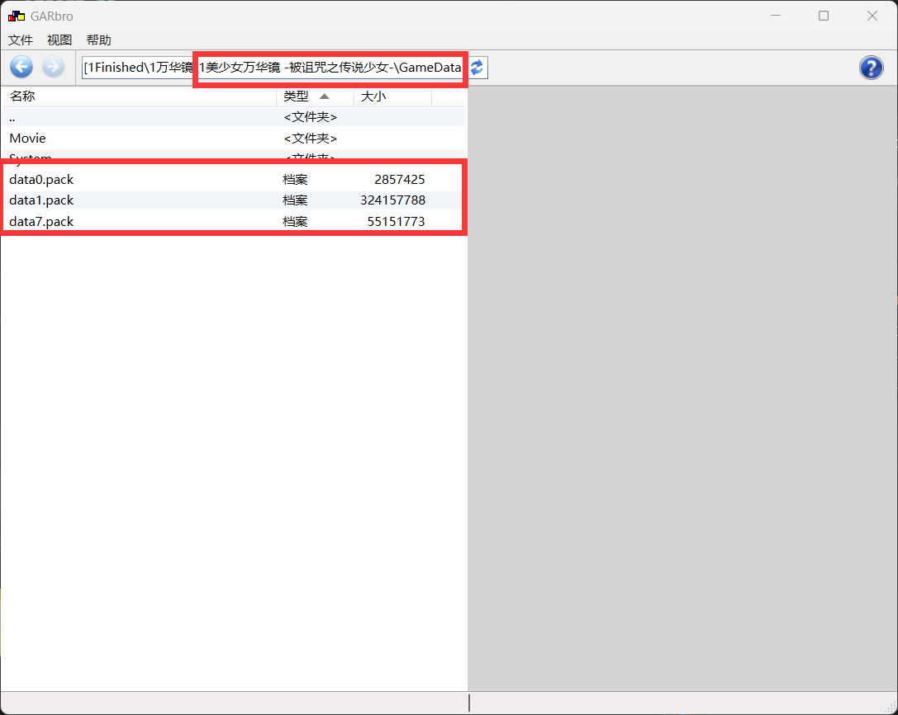

* 在资源树中寻找 `voice/`、`wav/`、`ogg/`、`scene/`、`script/` 等目录，右键选择 `Extract`（导出到本地目录）。
> `data01.pack/scenario/ks_01` 目录下存放了所有文本字幕文件，这些文件是 `.s` 格式，包含了文本数据，这些数据与音频一一对应。
> 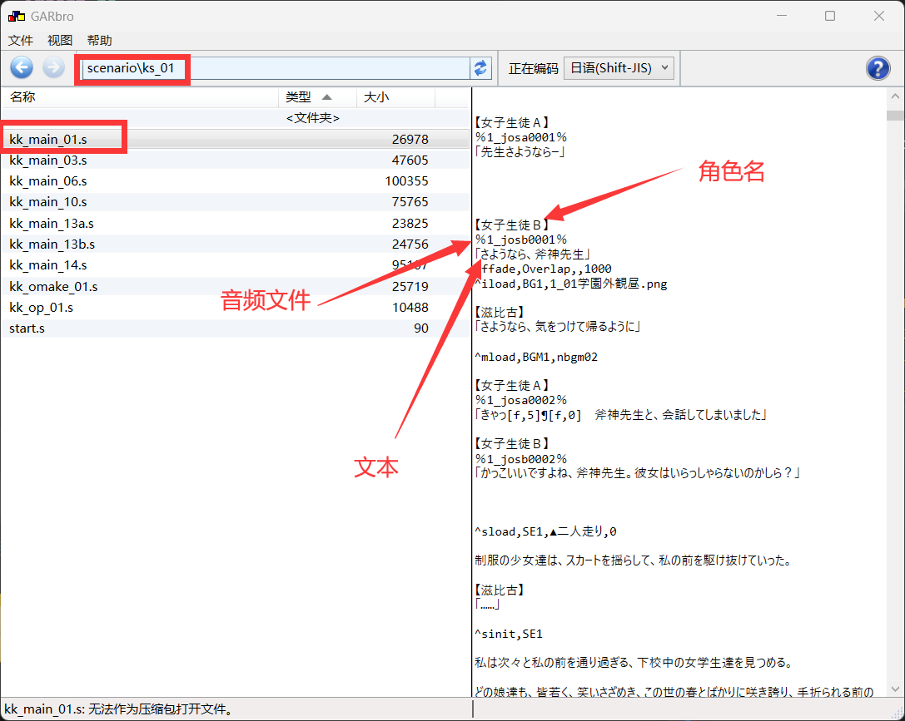
> `data02.pack/voice/` 目录下存放了所有音频文件，这些文件是 `.ogg` 格式，包含了语音数据，这些数据与文本字幕一一对应。
> 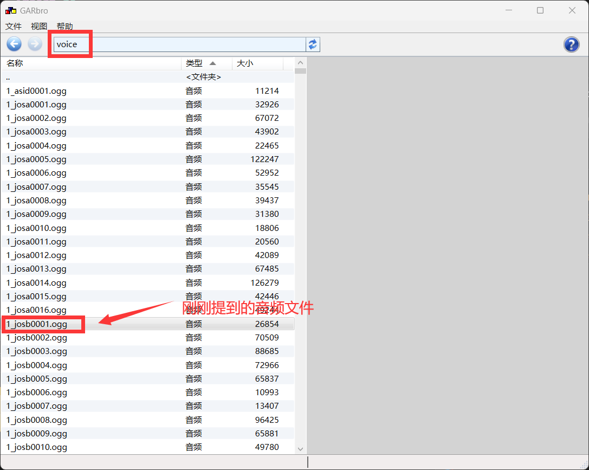
> 现在选择你需要的数据提取，例如我们在此提取雾枝的数据（全部文本和雾枝的语音），注意此处角色名会对应一个音频文件名，例如女子生徒B对应josb，雾枝对应kiri，以下针对雾枝进行提取，所以应该导出含有kiri的所有音频文件。
> 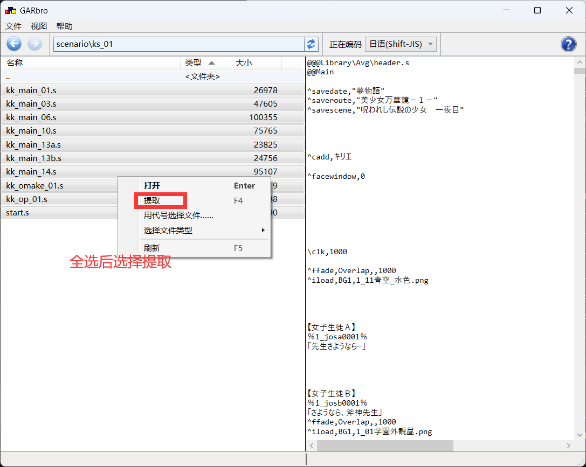
> 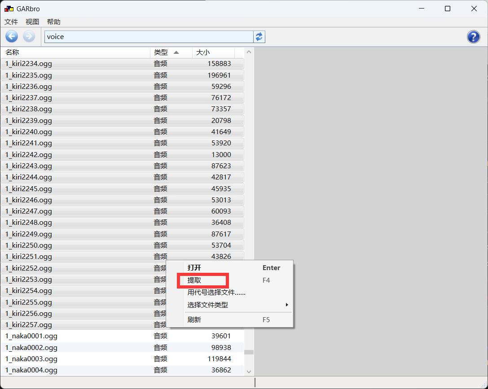
* 常见导出项：`.ogg` / `.wav` / `.awb`（有时需用 ffmpeg 或专用解包器转换）与脚本 `.s` / `.ks` / `.txt`。
* 注意：脚本文件可能有多种编码（utf-8、cp932、shift_jis、utf-16）。遇乱码请用支持多编码的读取方式。
> 提取完成后，保存到对应的文件夹中并查看。
> 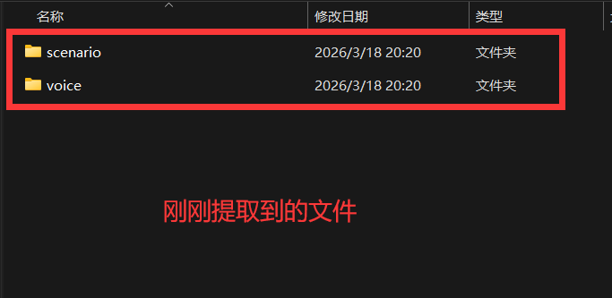
> 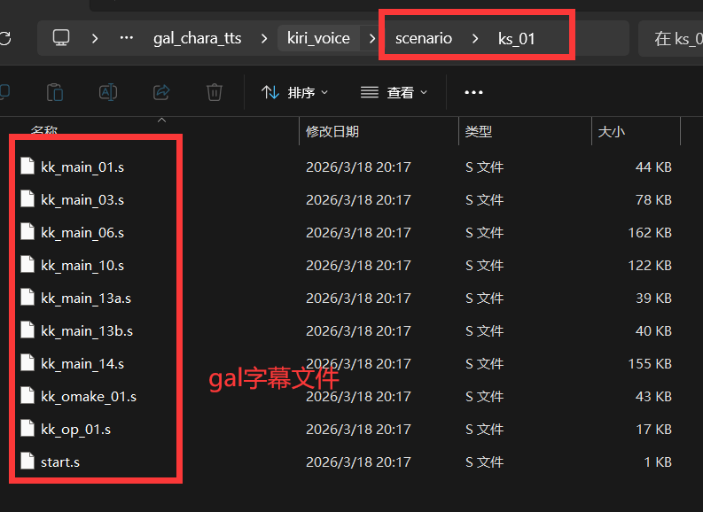
> 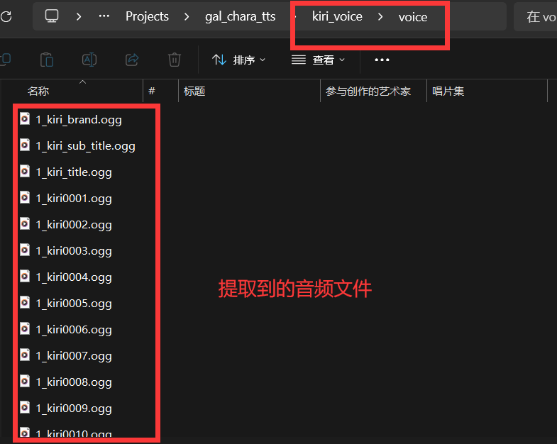

---

### Step 2 — 使用 AI 修改/定制你的数据提取代码（核心）

我给出的代码`Dataset_Builder.py`实现了：扫描 `.s` 文件、用正则匹配台词、读取对应 `ogg` 文件、检查时长并生成 GUI 供人工筛选与导出。

**重要：将代码和你的实际目录/需求发给 AI，让 AI 根据你的环境做定制修改（见后面的 Prompt 模板）。**

**要点说明（你和 AI 可以修改或确认的地方）**

**必须更改的：`S_FILES_DIR`, `OGG_DIR`, `OUTPUT_LIST`、`TARGET_CHARACTER` 等变量需要改成你本地路径与目标角色。~~（这里不写进GUI的原因是想确认你有与AI对话并修改代码的能力，笑）~~**
* **下面的可选或者不需要修改：**
* 正则 `pattern = re.compile(r'【([^】]+)】\s*[%％]([^%％]+)[%％]\s*「([^」]+)」')` 可能需按脚本实际格式调整，此处正则筛选角色和文本等，你需要将此正则结合你的`.s`文件内容发给AI。
> 提示词例如：
> >我提取出了音频文件，例如1_kiri0558.ogg；和一些.s文件，文件内容例如
> >^cface,,赤目伏し目04
> >【キリエ】
> >％1_kiri1342％
> >「あれから、私考えたのよ……あの時はあんな風に言ってしまったけれど、先生は、とてもショックを受けていたんだって……」
> >
> >【滋比古】
> >「いや、いいんだ。あの事はもう忘れようじゃないか……」
> >
> >^cface,,赤目心配01
> >
> >キリエのしおらしい様子……女らしい控えめな態度を見て、私は彼女の謝罪を遮った>。
> >
> >【キリエ】
> >％1_kiri1343％
> >「でも……」
> > 帮助我修改代码中的正则式来匹配角色、音频文件和文本。
* 时长阈值 `2.0 <= duration <= 15.0` 可按需要放宽/收紧。
* `check_text_validity` 的规则是经验阈值（省略号、喘息检测、小假名数量等），可以让 AI 帮你调整或增加过滤规则（比如去除旁白、系统提示、音效文字等）。

**直接给 AI 的修改请求示例（模板见文末）——把完整代码粘进去并替换环境变量说明。**

---

### Step 3 — 数据清洗与导出（脚本 + GUI）

**如果脚本运行顺利，那么你的GUI将会正常出现（运行脚本后需要等待一段时间，取决于音频和文本数量）**

> 本例如下：
> 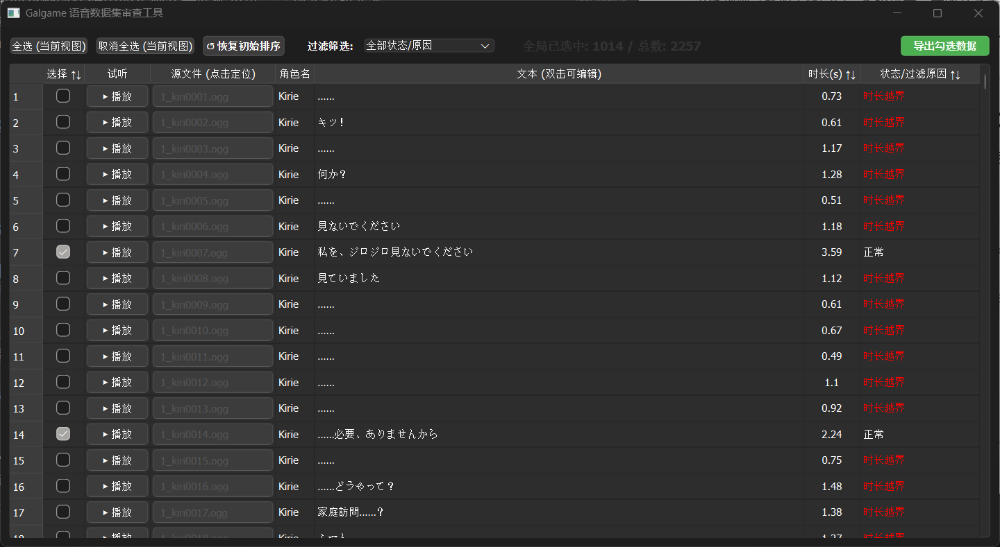

**目标输出格式（GPT-SoVITS 常见）**：每行一个样本，格式示例：

```
G:\Projects\gal_chara_tts\kiri_voice\voice\1_kiri0687.ogg|Kirie|JA|せ、先生……
```

**具体操作：**

1. 在 GUI 中先完成人工筛选：
   a. 去掉勾选噪音很大的条目，例如奇怪的声音等，去掉左侧的复选框，这会对你的模型造成不利影响。
   b. 检查由代码过滤的条目，如果你认为可以加入训练，那么勾选左侧的复选框。
   **提示**：你可以预览音频来判断是否需要保留，点击播放即可播放。
2. 筛选完成后，点击右上角的`导出勾选数据`按钮即可导出数据到脚本相同目录。
3. **不要关闭本窗口，后面还有用。**

---

### Step 4 — 导入 GPT-SoVITS 平台训练

**注意**：本教程仅指导如何使用 GPT-SoVITS 平台训练，对于其他平台，请自行查看教程。

1. 打开 GPT-SoVITS GUI，点击 `1-GPT-SoVITS-TTS` > `1A-训练集格式化工具`，在`输出logs/实验名目录下应有23456开头的文件和文件夹`下的`*文本标注文件`输入刚刚导出的 `GPT_SoVITS.list` 文件路径。
2. 输入`*实验/模型名`（你的角色名称）
3. 选择模型，建议`v2ProPlus`。
4. 点击最下方的`开始训练集格式化一键三连`等待数据集格式化完成（即右边的输出信息显示`训练集格式化一键三连已完成`）。

> 本例如下，模型名称填写Kirie：
> 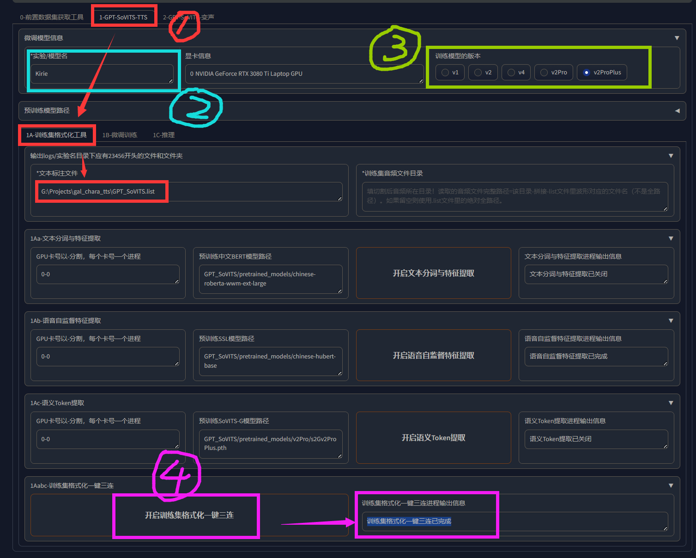

5. 点击`1B微调训练`进入训练界面，设置`batch_size`，`epoch`，`learning_rate`等参数，请结合显卡情况，具体设置请参考[GPT-SoVITS指南](https://www.yuque.com/baicaigongchang1145haoyuangong)。建议去掉勾选`是否仅保存最新的权重文件以节省硬盘空间`，以查看不同轮次下的模型效果（由于galgame音频较为纯净，建议**调小学习率**）。
6. 首先点击`开启SoVITS训练`，开始训练SoVITS模型，直到右侧输出`SoVITS训练已完成`。
7. 训练完成后，点击`开启GPT训练`，开始训练GPT模型，直到右侧输出`GPT训练已完成`。

> 本例如下：
> 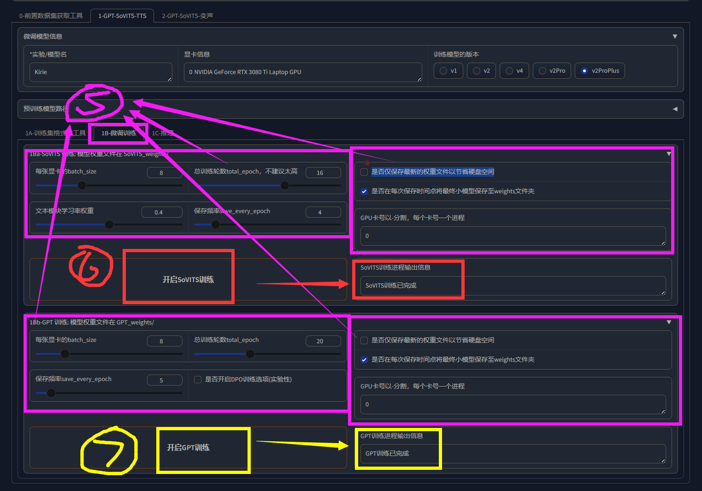

---

### Step 5 — 推理

1. 训练完成两个模型后，点击`1C-推理`进入推理界面，点击刷新模型路径。
2. 选择刚刚训练好的模型（如果去掉了`是否仅保存最新的权重文件以节省硬盘空间`，可能生成多个模型文件，选择一个即可）。
3. 点击`开启TTS文本推理WebUI`直到浏览器弹出新窗口（没有弹窗请手动在地址栏输入[http://localhost:9872/](http://localhost:9872/)）。

> 本例如下：
> 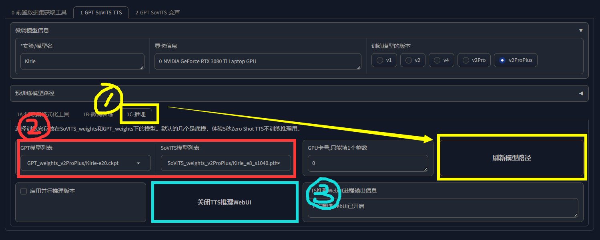

4. 在新窗口中，确认选择的模型。
5. 选择并上传参考音频和文本（使用之前的GUI界面，点击文件名即可跳转到音频位置，拖入音频上传框，随后双击文本复制，填入参考文本），需要注意的是，这段音频和文本会**很大程度上**影响输出的语气，所以你可能需要**试听后选择**。

> 本例如下：
> 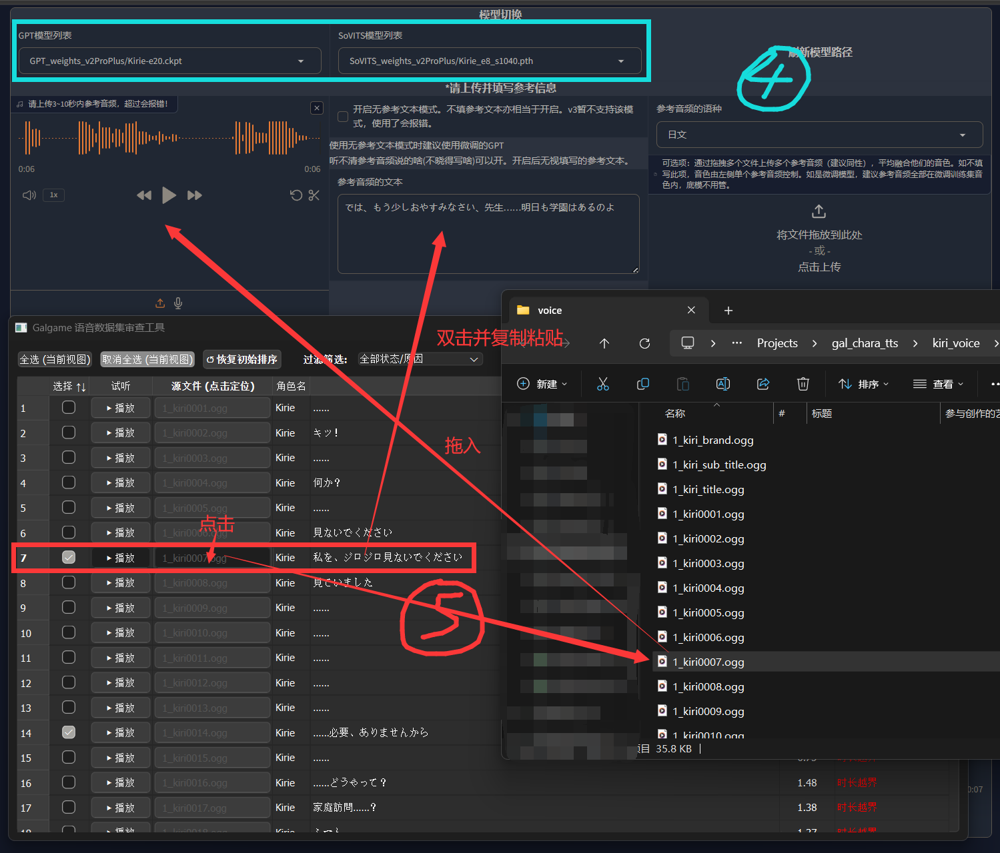

6. 选择参考音频的语种。
7. 输入需要合成的文本、语种和相关参数（参考[GPT-SoVITS指南](https://www.yuque.com/baicaigongchang1145haoyuangong)），点击`合成语音`，等待一段时间，点击右下角播放即可听到合成语音。

> 本例如下：
> 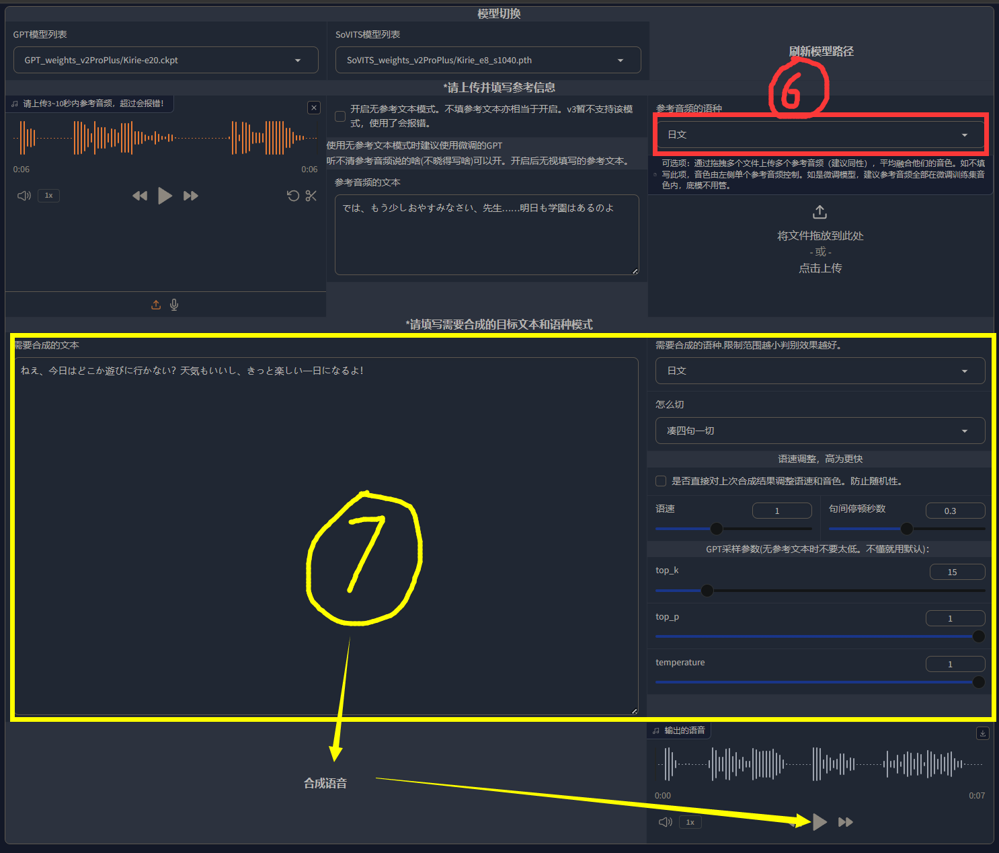

---

## 四、把我提供的代码发给 AI 修改

> **使用方式**：把下面模板中的方括号内容替换成你的实际信息，然后把你完整的 Python 代码一并粘贴给 AI。

```
我需要你帮我修改并增强一份用于 Galgame 语音数据集审查与导出的工具。我会把完整代码粘贴在后面。请根据以下需求修改并返回修改后的完整代码文件和变更说明：

我的需求：

1. 我需要你修改代码，使其能够处理我提供的脚本文件（.s）和音频文件（.ogg）。
2. 代码需要能够处理我要求的角色[TARGET_CHARACTER]。
3. 我的脚本文件目录是[S_FILES_DIR]，音频文件目录是[OGG_DIR]。
4. 我的脚本示例如下，请帮助我修改正则匹配表达式pattern：

[你的脚本示例，截取一段含有你要求角色对话文字的片段，参考Step 2中给出的示例]

现在下面是完整代码，请先阅读并在理解后返回修改后的完整代码及简短的变更说明。如果你遇到假定项（例如目标脚本格式）请说明你做了哪些假设并在代码中注明 TODO 处以便用户确认。

（下面粘贴我给出的Dataset_Builder.py）
```

---

## 五、常见问题

### 1. 如何处理问题？

最佳方式是问AI，如果AI不能解决，欢迎在GitHub上提交issue。

---

本项目参考了下面项目的源代码，在此感谢：
[Dataset_Maker_for_Galgames](https://github.com/KitsuneX07/Dataset_Maker_for_Galgames)

---

Developed with ❤️ by IceRinne